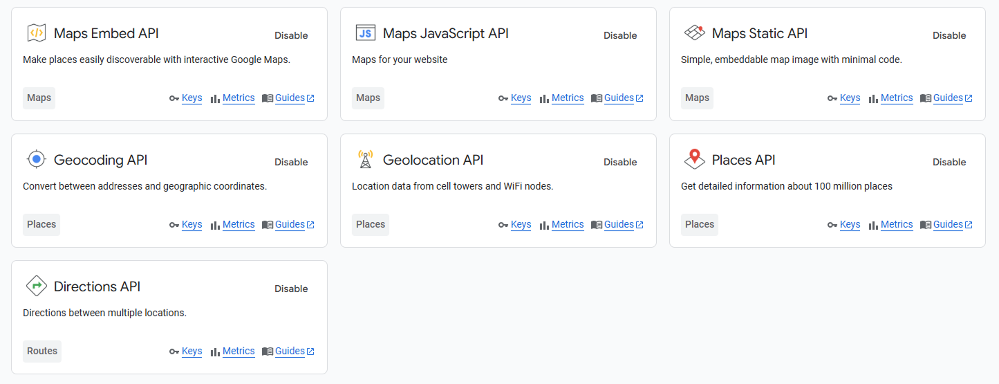
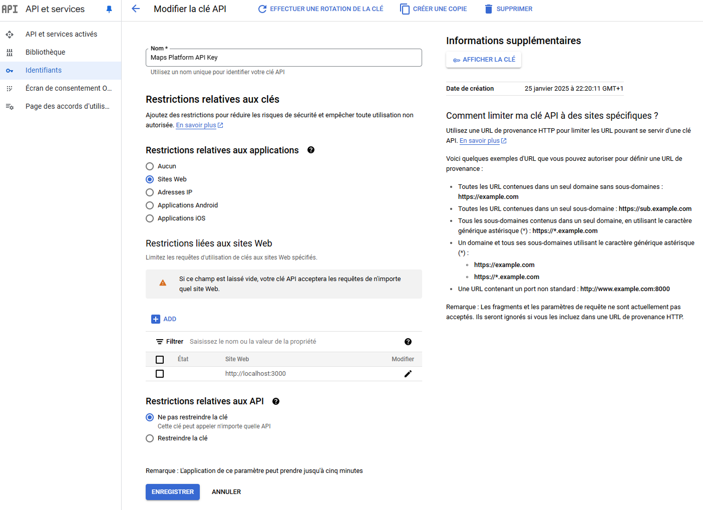
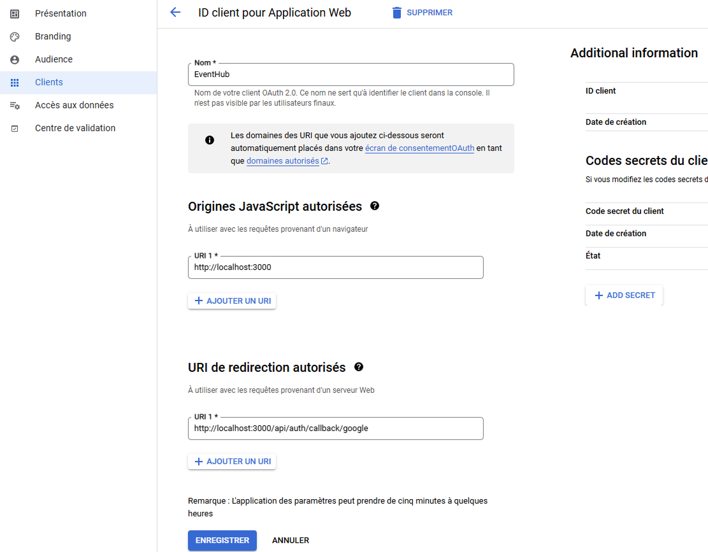

# Concepteur Web ADRAR 2024

Project fil rouge - Gesteur des événements

### Objectifs

Le but de ce projet est de valider les competences pour la obtention du titre Concepteur Web - bac+3 dans le cadre du concours ADRAR 2024.

### Technologies

  
  
  
  
  
  
  
  
  
  
  
  
  

### Description

Cet projet a pour fonctionnalité principal d'intégrer un système de gestion des événements pour les utilisateurs. La application permettre de créer et gérer des événements dans la plateforme et les synchroniser avec le calendrier de google. Il y a aussi un système de commentaires et ponctuation pour les utilisateurs, ainsi comme un système de messagerie et notifications.

### Liens

- [Site](https://filrouge2024.vercel.app/)
- [Figma](https://www.figma.com/design/dKas1GBEozCmW0RuG331EI/fil-rouge-2024?node-id=0-1&t=OdAsUR6EVt98mwsm-1)
- [Mémoire](https://docs.google.com/document/d/1DcWckybC7697-RW4LytWSzO_2fi7GIXWQsl40YLe4oQ/edit?usp=sharing)

# Instructions pour l'installation

## Requirements

- Node.js version 16.x
- Docker desktop

## Installation

- Cloner le projet `git clone https://github.com/FacuBotta/filrouge2024.git`
- Renommer le fichier `.env.example` en `.env`

- #### Configuration de variables d'environnement

  ### Google API

  - Créer un mot de passe d'application dans votre [compte google](https://myaccount.google.com/security) pour les variables d'environnement `EMAIL_SERVER_USER` et `EMAIL_SERVER_PASSWORD` (account/settings/security/two-step-verification/app-passwords)
  - Créer un projet dans votre compte [google console](https://console.cloud.google.com/welcome?_gl=1*1vr2jyh*_up*MQ..&gclid=CjwKCAiAt4C-BhBcEiwA8Kp0CTv4ZuMssDGWGkDPXxaQVxpVz3RvM8-tJ8tiEQKc3TR1xHTT-fkqGxoC-UIQAvD_BwE&gclsrc=aw.ds&inv=1&invt=AbqsTQ&project=filrouge2024&pli=1) et activer les API suivants :\
    
  - Ajouter la configuration suivante et récupérer la clé de l'API Google Maps pour la variable d'environnement `NEXT_PUBLIC_GOOGLE_MAPS_API_KEY` :\
    
  - Ajouter la configuration suivante et récupérer la clé et le secret de l'application pour les variables d'environnement `AUTH_GOOGLE_ID` et `AUTH_GOOGLE_SECRET` :\
    

  - Creer un chaîne de caractères aléatoire pour la variable `AUTH_SECRET` avec la commande suivante sur powershell :
  - `openssl rand -base64 33`
  - ### Remplir les variables dans le fichier .env

- Installer les dépendances avec `npm install`
- Aller sur le repertoire `database` et lancer la commande `docker compose up -d` pour démarrer la base de données
- Revenir à la racine du projet et lancer les commandes suivantes :
  - `npx prisma db push` pour créer les tables de la base de données
  - `npx prisma generate` pour générer le client de prisma
  - `npx prisma db seed` pour remplir la base de données avec les categories et des utilisateurs fictifs
- Lancer la commande `npm run dev` pour démarrer le serveur de développement

## ⚠️ Certains éléments sont encore en cours de développement ⚠️

- Le système de recherche marche seulement dans la page 'Communauté'
- Le dashboard Administrateur n'est pas encore implémenté
- La messagerie marche mais le websocket n'est pas encore implémenté
