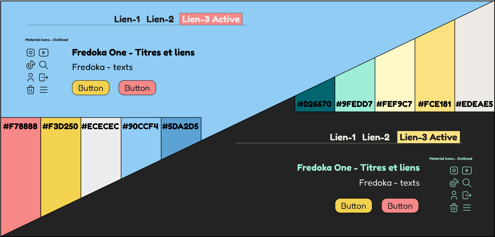

# Concepteur Web ADRAR 2024
Project fil rouge - Gesteur des événements

### Objectifs
Le but de ce projet est de valider les competences pour la obtention du titre Concepteur Web - bac+3 dans le cadre du concours ADRAR 2024.

### Technologies

  
  
  
  
  
  
  
  
  
  
  
  
  

### Description

Cet projet a pour fonctionnalité principal d'intégrer un système de gestion des événements pour les utilisateurs. La application permettre de créer et gérer des événements dans la plateforme et les synchroniser avec le calendrier de google. Il y a aussi un système de commentaires et ponctuation pour les utilisateurs, ainsi comme un système de messagerie et notifications.

### Charte graphique

### Maquette

## Travail en cours...
